## Σ Barbotine Arbitrage
<p align="left">
  
  
</p>

[](https://github.com/nelso0)

## Table of content
* [Features](#features)
* [Prerequisites](#prerequis)
* [Installation](#installation)
* [Usage](#usage)
* [How does it work](#how)
* [Full version](#full-version)

<a name="features"/>
 
## Features

* Compatible with all [ccxt](https://github.com/ccxt/ccxt) exchanges
* Ready-to-run
* Precise at the orderbook level (close to a market-making algorithm)
* Can work with an unlimited number of exchanges at the same time
* Does a balance simulation for every possible opportunity to always choose the most profitable one
* Opportunities updates on Telegram and webhooks
* Full logging system

<a name="prerequis"/>
 
## Prerequisites

* Python 3+ inferior to 3.12! (for windows users: if python or pip isn't recognized as a command, make sure you have installed python by checking the box "add to PATH")

<a name="installation"/>
 
## Installation

1. Clone the repository 
```sh
git clone https://github.com/nelso0/barbotine-arbitrage-bot # you can also download the zip file
```
2. Go to the repository you just cloned
```sh
cd barbotine-arbitrage-bot
```
3. Install all the requirements to run the arbitrage system
```sh
pip install -r requirements.txt
```
4. Set your configuration details in [exchange_config.py](exchange_config.py)
5. Run with:
```sh
python run.py
```

<a name="usage"/>
 
## Usage

You can also run it with one line like this:

```sh
python run.py <mode> [renew-time-minutes] <balance-usdt-to-use> <pair> <exchanges list separated by commas (no space!)>
```


* ```<mode>``` = the mode you wanna use between ```fake-money``` and ```real```. See [full version](#full-version) for real mode. 
  
  * ```fake-money``` will run the bot with the balance-usdt-to-use you put, with a virtual balance, just to test.
  * ```real``` will run the bot with real money, and your strategy.
  
* ```[renew-time-minutes]``` = ONLY IF YOU ENABLED RENEWAL SETTING IN THE CONFIG. If you enabled it, you have to put the number of minutes a session should last. After each session, the bot sells all the assets back to rebalance. Note: you can trigger a manual rebalance while in a session by pressing the Enter key.

* ```<balance-usdt-to-use>``` = how to be clearer? 

* ```<pair>``` = The pair you want to arbitrage on.

* ```<exchanges list>``` = the exchanges you want the bot to scan the orderbooks on, among all the [CCXT-compatible exchanges](https://github.com/ccxt/ccxt). From a 2 exchanges minimum, up to an unlimited number. Don't forget to configure the exchanges in [exchange_config.py](exchange_config.py).

Examples:

with renewal disabled (default):
```sh
python run.py fake-money 500 EOS/USDT binance,okx,kucoin    # run the bot with 500 USDT and rebalance every 15 minutes, with binance okx and kucoin
```
with renewal enabled:
```sh
python run.py real 15 1000 SOL/USDT binance,poloniex,kucoin   # run the bot with 1000 USDT on binance phemex and bybit on SOL/USDT, and rebalance every 15 minutes.
```

<a name="how"/>
## How does it work?

```mermaid
flowchart TD
    A[Start bot] --> B[Parse arguments<br/>mode, pair, balance, exchanges]
    B --> C[Load exchange configs<br/>& connect via CCXT]
    C --> D{Mode?}
    
    D -->|Real| E[Fetch real balances<br/>from all exchanges]
    D -->|Fake Money| F[Use input balance<br/>from config]
    
    E --> G[Calculate initial allocation]
    F --> G
    
    G --> H[Distribute balance equally<br/>fetch average price<br/>calculate crypto amounts]
    
    H --> I[Place initial buy orders<br/>on all exchanges]
    I --> J[Wait for order fulfillment]
    
    J --> K[Start main arbitrage loop]
    
    K --> L[Monitor orderbooks<br/>parallel WebSocket connections]
    L --> M[Update price dictionaries<br/>bid_prices & ask_prices]
    
    M --> N[Find best opportunities<br/>min_ask_ex & max_bid_ex]
    N --> O[Calculate profit<br/>including fees]
    
    O --> P{Profitable<br/>opportunity?}
    
    P -->|No| Q[Display current best<br/>continue monitoring]
    Q --> R{Session<br/>timeout?}
    
    P -->|Yes| S[Execute simultaneous trades<br/>BUY on min_ask_ex<br/>SELL on max_bid_ex]
    
    S --> T[Update balances<br/>& rebalance positions]
    T --> U[Log profit & send<br/>Telegram notification]
    U --> V[Increment trade counter<br/>update session totals]
    
    V --> R
    R -->|No| W{Manual stop<br/>requested?}
    W -->|No| L
    W -->|Yes| X[Emergency rebalance]
    
    R -->|Yes| Y[Session end cleanup]
    X --> Y
    
    Y --> Z[Cancel open orders<br/>convert all crypto to USD]
    Z --> AA[Calculate final balance<br/>& session profit]
    AA --> BB[Update real_balance.txt<br/>generate report]
    BB --> CC[End session]
    
    style A fill:#e1f5fe
    style G fill:#f3e5f5
    style K fill:#fff3e0
    style P fill:#ffebee
    style S fill:#e8f5e8
    style CC fill:#fce4ec
```



<a name="full-version"/>

## Full version

You can get the source code of the real money modes and the rest of the arbitrage system by becoming a Barbotine donator. More info on [barbotine.xyz](https://barbotine.xyz)
